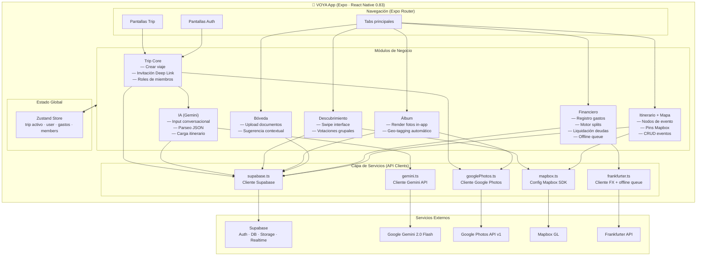
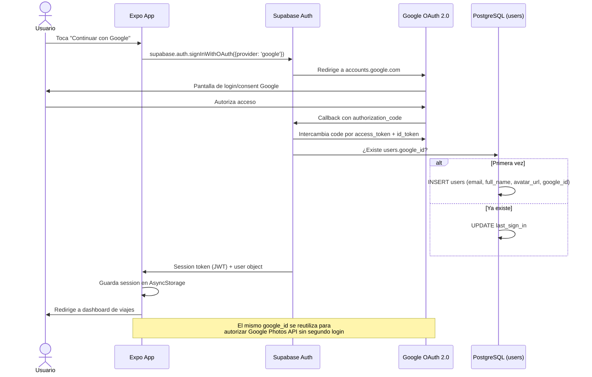
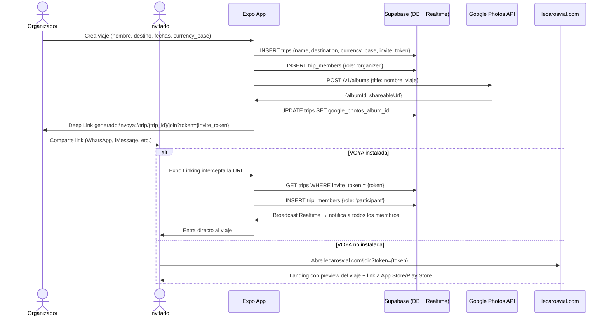
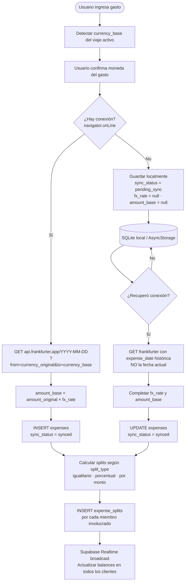
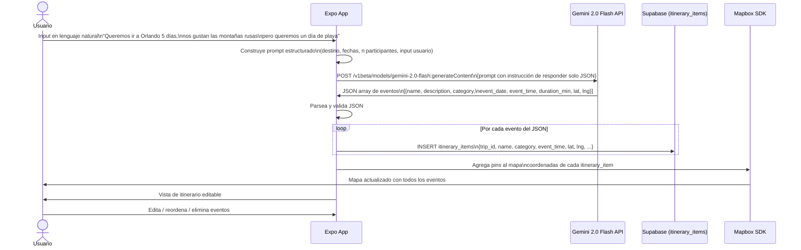
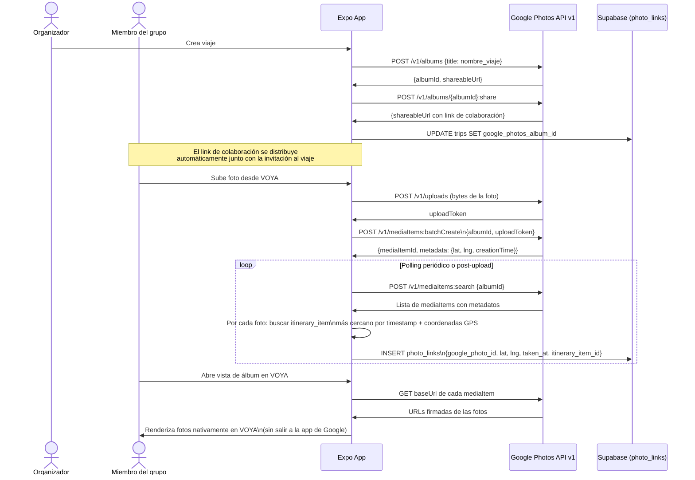
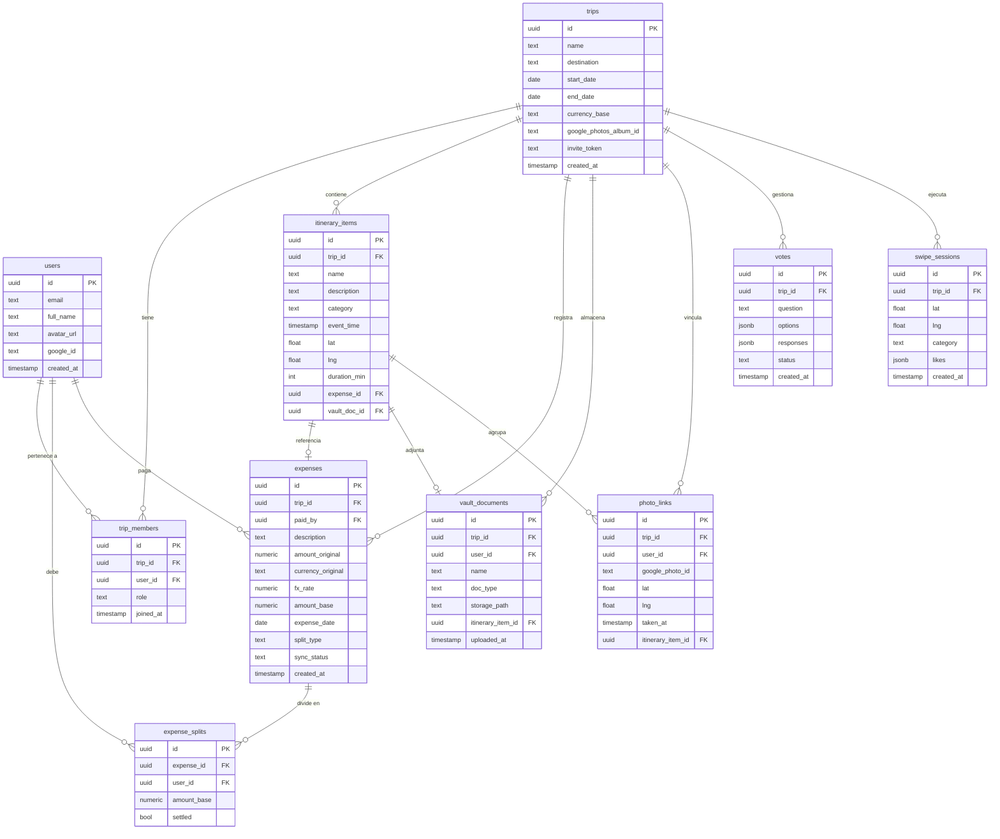
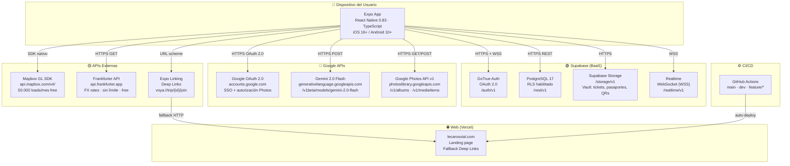
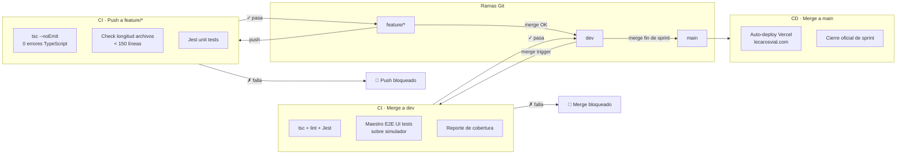

# VOYA — Documento de Diseño
**Versión:** 0.1  
**Fecha:** Abril 2026  
**Autor:** Raimundo Lecaros Vial  

---

## INFORMACIÓN DEL DOCUMENTO

| Campo | Detalle |
|---|---|
| Proyecto | VOYA — Concierge de Viajes Grupal con IA |
| Autor | Raimundo Lecaros Vial |
| Versión | 0.1 — Documento inicial |
| Fecha | Abril 2026 |
| Repositorio | Por definir (GitHub) |
| Dominio web | lecarosvial.com |

### Historia del documento

| Versión | Fecha | Cambio |
|---|---|---|
| 0.1 | Abril 2026 | Documento inicial — diseño base completo |

---

## 1. DESCRIPCIÓN GENERAL

### 1.1 Descripción de la Empresa / Proyecto

VOYA es una startup de tecnología fundada por Raimundo Lecaros Vial, orientada a transformar la forma en que los grupos de amigos planifican, organizan y viven sus viajes. La empresa nace de la observación directa de un problema cotidiano: la fragmentación de la logística grupal entre WhatsApp, Excel, Splitwise y distintas apps de reservas genera caos, pérdida de información y fricciones innecesarias. VOYA apunta a convertirse en el estándar para la gestión de viajes entre amigos.

### 1.2 Visión General

VOYA es un **concierge de viajes grupal impulsado por IA**, diseñado para ser el único punto de verdad de un grupo durante todo el ciclo de un viaje: desde la planificación inicial hasta la preservación de los recuerdos.

**El sistema contempla:**

- **Itinerario + Mapa vivo:** cada evento del viaje (vuelo, reserva, actividad) es un nodo rico conectado a un mapa Mapbox interactivo. Conecta costo, documento y ubicación en un solo objeto.
- **Gestión financiera grupal:** registro de gastos con detección automática de moneda y tipo de cambio via Frankfurter API. Motor de splits configurables (igualitario, porcentual, por monto) y liquidación de deudas grupales. Soporta modo offline con estado `pending_sync`.
- **Bóveda de documentos:** almacenamiento de tickets, pasaportes y QRs en Supabase Storage, con sugerencias contextuales según el evento activo del itinerario.
- **Álbum colaborativo:** integración con Google Photos API v1. El storage y la lógica de álbum compartido es de Google; VOYA renderiza las fotos nativamente dentro de la app con geo-tagging automático vinculado al itinerario.
- **IA para planificación:** interfaz conversacional donde el usuario describe su viaje en lenguaje natural y Google Gemini 2.0 Flash genera un itinerario base estructurado que se carga directamente en el módulo de itinerario.
- **Modo Swipe / Votaciones:** interfaz tipo Tinder para selección grupal de restaurantes y actividades, y sistema de votaciones formales para decisiones del día.

**El sistema NO contempla (v1):**

- Integración con sistemas de reservas externos (Booking, Airbnb).
- Pagos en línea o transferencias directas entre usuarios.
- Soporte para viajes en solitario.
- Modelos predictivos o de clasificación de comportamiento.

### 1.3 Características de los Usuarios

| Tipo de usuario | Descripción | Cantidad actual | Cantidad esperada |
|---|---|---|---|
| **Organizador** | Crea el viaje, define el itinerario, invita al grupo y administra los gastos. Tiene control total sobre el viaje. | 1–2 por viaje | Miles (proyección 12 meses) |
| **Participante** | Miembro del grupo invitado vía Deep Link. Puede editar itinerario, registrar gastos y subir fotos. | 2–10 por viaje | Decenas de miles |
| **Espectador** | Acceso de solo lectura al viaje. Puede ver el itinerario y el álbum pero no editar. | Opcional | Variable |

### 1.4 Definiciones, Acrónimos y Abreviaturas

| Término | Definición |
|---|---|
| **Viaje (Trip)** | Unidad principal del sistema. Agrupa itinerario, gastos, documentos y álbum de un grupo. |
| **Nodo de evento** | Cada ítem del itinerario. Objeto rico que conecta costo, documento y ubicación geográfica. |
| **Bóveda (Vault)** | Repositorio de documentos del viaje: tickets, pasaportes, QRs, reservas. |
| **Split** | Lógica de distribución de un gasto entre miembros del grupo. Puede ser igualitario, porcentual o por monto fijo. |
| **pending_sync** | Estado de un gasto registrado offline. Indica que el tipo de cambio aún no se ha resuelto porque no había conexión. |
| **Deep Link** | Enlace de invitación (`voya://trip/{id}/join?token={token}`) que une a un usuario al viaje directamente. |
| **currency_base** | Moneda de referencia del viaje (ej: CLP). Todos los gastos se convierten a esta moneda para los cálculos de liquidación. |
| **Expo** | Framework de desarrollo móvil multiplataforma basado en React Native. |
| **Supabase** | Plataforma BaaS basada en PostgreSQL con Auth, Storage y Realtime. |
| **BaaS** | Backend-as-a-Service. Backend gestionado externamente, sin servidores propios. |
| **RLS** | Row Level Security. Política de seguridad a nivel de fila en PostgreSQL que restringe acceso por usuario. |

### 1.5 Referencias

- Documentación oficial Expo: https://docs.expo.dev
- Documentación oficial Supabase: https://supabase.com/docs
- React Native 0.83: https://reactnative.dev
- Google Gemini API: https://ai.google.dev/docs
- Google Photos API v1: https://developers.google.com/photos
- Mapbox GL SDK React Native: https://docs.mapbox.com/react-native
- Frankfurter API: https://www.frankfurter.app/docs
- Maestro (testing UI): https://maestro.mobile.dev

---

## 2. METODOLOGÍA

### 2.1 Metodología de Trabajo

VOYA se desarrolla bajo un esquema de **sprints orientados a objetivos**, sin fechas fijas de cierre. Cada sprint se define por un conjunto de Requerimientos Funcionales (RF) y No Funcionales (RNF) que deben estar completamente implementados antes de iniciar el siguiente. Esto permite mantener un ritmo de desarrollo sostenible para un equipo unipersonal, priorizando la completitud sobre la velocidad.

Al cierre de cada sprint se realiza una revisión personal del estado del sistema, verificando:
- Todos los RF y RNF del sprint están cubiertos.
- No existen errores de TypeScript.
- El código cumple la regla de archivos < 150 líneas.
- Los tests unitarios y de UI pasan sin errores.
- La build de Expo compila sin warnings críticos.

Solo cuando todos estos criterios se cumplen se avanza al sprint siguiente.

La deuda técnica se aborda dentro del sprint en curso: si se detecta durante el desarrollo, se agrega como tarea prioritaria antes de cerrar el sprint.

Las notas de diseño, decisiones técnicas e ideas se registran informalmente en **Obsidian**.

### 2.2 Flujo de Trabajo

**Estrategia de ramas (Git branching):**

```
main        ← producción; solo recibe merges desde dev al cerrar un sprint
  └── dev   ← integración activa; recibe merges de feature branches
        └── feature/nombre-funcionalidad   ← una rama por RF del sprint
```

Flujo completo:
1. Se crea `feature/nombre-funcionalidad` desde `dev`.
2. Se implementa el RF respetando las reglas de calidad.
3. Se hace merge de `feature/*` a `dev` al completarse.
4. Al cerrar el sprint (todos los RF/RNF cubiertos y testeados), se hace merge de `dev` a `main`.

**Definition of Done (criterio de terminado):**
- RF implementado y funcional en simulador y dispositivo físico.
- 0 errores de TypeScript en los archivos modificados.
- Archivo < 150 líneas; si no, refactorizar antes del merge.
- Tests unitarios cubriendo la lógica del feature.
- Tests de UI (Maestro) pasando para los flujos afectados.
- Build de Expo compila sin warnings críticos.
- Merge a `dev` completado; merge a `main` solo al cierre del sprint completo.

**Pipeline CI/CD (GitHub Actions):**

| Trigger | Checks |
|---|---|
| Push a `feature/*` | TypeScript (`tsc --noEmit`), longitud de archivos < 150 líneas, Jest unit tests |
| Merge a `dev` | Todo lo anterior + Maestro UI tests completos + reporte de cobertura |
| Merge a `main` | Auto-deploy de landing page a Vercel |

### 2.3 Herramientas de Trabajo

| Herramienta | Rol |
|---|---|
| **Expo (React Native 0.83)** | Framework principal de desarrollo móvil multiplataforma (iOS y Android) |
| **Supabase** | BaaS: PostgreSQL 17, GoTrue Auth, Storage, Realtime |
| **TypeScript** | Lenguaje principal; 0 errores como estándar de calidad |
| **GitHub** | Control de versiones con estrategia main / dev / feature/* |
| **GitHub Actions** | CI/CD: TypeScript check, Jest, Maestro, deploy a Vercel |
| **Jest** | Framework de testing unitario para lógica de negocio |
| **Maestro** | Testing E2E de UI sobre simulador/dispositivo físico |
| **Claude Code + MCP** | Agente de IA para desarrollo asistido y generación/mantenimiento de tests Maestro |
| **Obsidian** | Registro informal de decisiones de diseño y estado del proyecto |
| **Vercel** | Hosting de la landing page (lecarosvial.com), auto-deploy desde main |

---

## 3. ARQUITECTURA DEL SISTEMA

### 3.1 Arquitectura General

VOYA sigue una arquitectura de **cliente móvil con BaaS (Backend-as-a-Service)**, complementada por servicios externos especializados. No existen servidores propios. El sistema se organiza en cuatro capas:

1. **Capa de Cliente:** aplicación móvil Expo (React Native 0.83), disponible para iOS y Android. Único punto de interacción del usuario con el sistema.
2. **Capa de Backend (Supabase):** gestiona autenticación, base de datos relacional (PostgreSQL 17), almacenamiento de documentos (Supabase Storage) y sincronización en tiempo real entre miembros del grupo via WebSocket.
3. **Capa de Servicios Externos:** integra proveedores especializados para funcionalidades que exceden el scope del BaaS.
4. **Capa Web:** `lecarosvial.com` (Vercel) actúa como landing page del producto y punto de entrada para los Deep Links de invitación cuando VOYA no está instalada.

### 3.2 Diagrama de Componentes



### 3.3 Servicios Externos

| Servicio | Proveedor | Endpoint / SDK | Función |
|---|---|---|---|
| **Autenticación social** | Supabase Auth (GoTrue) | `/auth/v1` · OAuth 2.0 | Login con Google ID y Apple ID |
| **Base de datos** | Supabase PostgreSQL 17 | `/rest/v1` | Todas las entidades del sistema |
| **Storage (docs)** | Supabase Storage | `/storage/v1` | Vault: tickets, pasaportes, QRs |
| **Realtime** | Supabase Realtime | `/realtime/v1` · WSS | Sync en tiempo real entre miembros |
| **IA conversacional** | Google Gemini 2.0 Flash | `generativelanguage.googleapis.com/v1beta` | Planificación de itinerarios |
| **Álbum colaborativo** | Google Photos API v1 | `photoslibrary.googleapis.com/v1` | Storage y gestión de media |
| **Autenticación Google** | Google OAuth 2.0 | `accounts.google.com` | SSO login + autorización Photos |
| **Mapas** | Mapbox GL SDK | `api.mapbox.com/v4/` | Mapa interactivo, pins, rutas |
| **Tipo de cambio** | Frankfurter API | `api.frankfurter.app/latest` | FX rates en tiempo real e históricos |
| **Deep Links** | Expo Linking | — | Invitaciones al viaje multiplataforma |
| **Landing + fallback** | Vercel | lecarosvial.com | Landing page y fallback de Deep Links |

### 3.3 Módulos Principales de la Aplicación

La app se estructura en siete módulos lógicos independientes que comparten el estado global del viaje activo:

**Módulo 1 — Trip Core**
Unidad central del sistema. Gestiona la creación del viaje, el sistema de invitaciones via Deep Link y los roles de los miembros (Organizador / Participante / Espectador). Al crear un viaje genera el `invite_token` único y el álbum compartido en Google Photos.

**Módulo 2 — Itinerario + Mapa**
Cada evento del viaje es un nodo rico (tabla `itinerary_items`) conectado al mapa Mapbox. Gestiona creación, edición y visualización de eventos con su costo, documento y ubicación asociados. Soporta output de la IA (Gemini).

**Módulo 3 — Financiero (Expenses)**
Registro de gastos con detección automática de moneda. Consulta Frankfurter API para obtener el FX rate. Modo offline-first: guarda con `sync_status = pending_sync` y resuelve la conversión al recuperar conexión (usando la fecha del gasto, no la de la sincronización). Motor de splits (igualitario, porcentual, por monto) y liquidación de deudas grupales.

**Módulo 4 — Bóveda (Vault)**
Almacenamiento de documentos en Supabase Storage. Lógica contextual que sugiere el documento correcto según el `itinerary_item` activo (pasaporte en check-in, ticket en entrada al parque, etc.).

**Módulo 5 — Álbum**
Integración con Google Photos API v1. Crea y gestiona un álbum compartido por viaje. Renderiza las fotos nativamente dentro de VOYA (sin salir a la app de Google). Geo-tagging automático: cada foto se vincula al `itinerary_item` más cercano por timestamp y coordenadas GPS.

**Módulo 6 — Descubrimiento (Swipe + Votaciones)**
Interfaz tipo Tinder para selección grupal de lugares cercanos via Mapbox. Sistema de votaciones formales para decisiones del día siguiente.

**Módulo 7 — IA (Gemini)**
Interfaz conversacional donde el usuario describe su viaje. Construye un prompt estructurado con el mensaje del usuario, fechas y número de participantes, y lo envía a Gemini 2.0 Flash. Parsea la respuesta JSON y crea los `itinerary_items` correspondientes.

---

## 4. VISTA DE PROCESOS

### 4.1 Autenticación de Usuarios



VOYA no tiene formularios de registro. El onboarding ocurre exclusivamente via OAuth 2.0 a través de Supabase Auth (Google ID y Apple ID).

**Nota clave:** El mismo Google ID usado para autenticación se reutiliza para autorizar el acceso a Google Photos API. El usuario se autentica una sola vez.

### 4.2 Creación de Viaje e Invitación Grupal



**Flujo:**
1. El Organizador crea un nuevo viaje con nombre, destino y fechas aproximadas.
2. El sistema crea el registro en `trips` con `currency_base` definida por el Organizador.
3. Se genera un `invite_token` único y se construye el Deep Link: `voya://trip/{trip_id}/join?token={invite_token}`.
4. Se crea un álbum compartido en Google Photos API y se guarda el `google_photos_album_id` en `trips`.
5. El Organizador comparte el link por cualquier medio.
6. Al abrir el link:
   - Con VOYA instalada: Expo Linking intercepta y une al usuario al viaje.
   - Sin VOYA instalada: redirige a `lecarosvial.com` (landing con preview del viaje y link a la app store).
7. Al unirse: se crea registro en `trip_members` con rol `participant`.
8. Supabase Realtime notifica a todos los miembros existentes via WebSocket.

### 4.3 Registro de Gasto (con manejo offline)



**Si hay conexión (sync_status = synced):**
1. GET `api.frankfurter.app/{expense_date}?from={currency_original}&to={currency_base}`.
2. Se calcula `amount_base = amount_original × fx_rate`.
3. INSERT en `expenses` con todos los campos completos y `sync_status = synced`.
4. Se calculan los splits e INSERT en `expense_splits`.
5. Supabase Realtime notifica al grupo: todos ven el nuevo gasto y sus balances actualizados.

**Si no hay conexión (sync_status = pending_sync):**
1. Se guarda el gasto localmente con `amount_original`, `currency_original`, `expense_date` y `sync_status = pending_sync`.
2. `fx_rate` y `amount_base` quedan null hasta la sincronización.
3. Al recuperar conexión: GET Frankfurter con la `expense_date` histórica (no la fecha actual).
4. Se completan `fx_rate` y `amount_base`, y `sync_status` cambia a `synced`.
5. Se sincronizan los splits y se notifica al grupo.

### 4.4 Planificación de Itinerario con IA (Gemini)



**Flujo:**
1. Usuario accede al módulo de IA y describe su viaje en lenguaje natural.
2. La app construye un prompt estructurado con destino, fechas, número de participantes e input del usuario.
3. POST a Gemini 2.0 Flash con instrucción explícita de responder solo JSON (ver Anexo C).
4. Se parsea la respuesta JSON y se valida la estructura.
5. Por cada evento: INSERT en `itinerary_items` vinculado al viaje activo.
6. El mapa Mapbox se actualiza automáticamente con los nuevos pins.
7. El usuario puede editar, reordenar o eliminar cualquier evento sugerido.

### 4.5 Álbum Colaborativo (Google Photos)



**Flujo:**
1. Al crear el viaje, VOYA crea un álbum compartido en Google Photos API y guarda el `albumId`.
2. El link de colaboración se distribuye automáticamente a los miembros junto con la invitación.
3. Cada miembro sube fotos directamente al álbum desde VOYA via API.
4. VOYA extrae metadatos (timestamp, GPS) y vincula cada foto al `itinerary_item` más cercano.
5. Las fotos se renderizan nativamente dentro de VOYA usando URLs firmadas de Google Photos.

---

## 5. VISTA DE DATOS

**Base de datos:** PostgreSQL 17 via Supabase. Row Level Security (RLS) habilitado en todas las tablas.

### 5.1 Diagrama Entidad-Relación



### 5.2 Esquema de Tablas

#### `users`
Generado automáticamente por Supabase Auth (GoTrue). No duplica info que Google ya gestiona.

| Campo | Tipo | Descripción |
|---|---|---|
| `id` | uuid PK | Generado por Supabase Auth |
| `email` | text | Email del proveedor OAuth |
| `full_name` | text | Nombre del proveedor OAuth |
| `avatar_url` | text | URL del avatar del proveedor |
| `google_id` | text | Google ID para reutilizar auth en Photos API |
| `created_at` | timestamp | Fecha de registro |

#### `trips`
Unidad central del sistema.

| Campo | Tipo | Descripción |
|---|---|---|
| `id` | uuid PK | — |
| `name` | text | Nombre del viaje |
| `destination` | text | Destino principal |
| `start_date` | date | Fecha de inicio |
| `end_date` | date | Fecha de fin |
| `currency_base` | text | Moneda de referencia del grupo (ej: CLP) |
| `google_photos_album_id` | text | ID del álbum compartido en Google Photos |
| `invite_token` | text | Token único para el Deep Link de invitación |
| `created_at` | timestamp | — |

#### `trip_members`
Tabla de unión entre `users` y `trips`. Un usuario puede pertenecer a múltiples viajes.

| Campo | Tipo | Descripción |
|---|---|---|
| `id` | uuid PK | — |
| `trip_id` | uuid FK → trips | — |
| `user_id` | uuid FK → users | — |
| `role` | text | `organizer` / `participant` / `viewer` |
| `joined_at` | timestamp | — |

#### `itinerary_items`
Cada evento del itinerario. Objeto rico que conecta costo, documento y ubicación.

| Campo | Tipo | Descripción |
|---|---|---|
| `id` | uuid PK | — |
| `trip_id` | uuid FK → trips | — |
| `name` | text | Nombre del evento |
| `description` | text | Descripción |
| `category` | text | `vuelo` / `reserva` / `actividad` / `restaurante` / etc. |
| `event_time` | timestamp | Fecha y hora del evento |
| `lat` | float | Latitud geográfica |
| `lng` | float | Longitud geográfica |
| `duration_min` | int | Duración estimada en minutos |
| `expense_id` | uuid FK → expenses | Gasto asociado (opcional) |
| `vault_doc_id` | uuid FK → vault_documents | Documento asociado (opcional) |

#### `expenses`
Registro de gastos con soporte offline-first.

| Campo | Tipo | Descripción |
|---|---|---|
| `id` | uuid PK | — |
| `trip_id` | uuid FK → trips | — |
| `paid_by` | uuid FK → users | Quién pagó |
| `description` | text | Descripción del gasto |
| `amount_original` | numeric | Monto en moneda original |
| `currency_original` | text | Moneda original (ej: USD) |
| `fx_rate` | numeric | Tipo de cambio aplicado (null si pending_sync) |
| `amount_base` | numeric | Monto en currency_base (null si pending_sync) |
| `expense_date` | date | Fecha real del gasto (usada para FX histórico) |
| `split_type` | text | `equal` / `percentage` / `amount` |
| `sync_status` | text | `synced` / `pending_sync` |
| `created_at` | timestamp | — |

#### `expense_splits`
Detalle del split por miembro. Separado de `expenses` para soportar splits heterogéneos.

| Campo | Tipo | Descripción |
|---|---|---|
| `id` | uuid PK | — |
| `expense_id` | uuid FK → expenses | — |
| `user_id` | uuid FK → users | — |
| `amount_base` | numeric | Monto que le corresponde en currency_base |
| `settled` | bool | Si la deuda fue saldada |

#### `vault_documents`
Documentos almacenados en Supabase Storage.

| Campo | Tipo | Descripción |
|---|---|---|
| `id` | uuid PK | — |
| `trip_id` | uuid FK → trips | — |
| `user_id` | uuid FK → users | Quién subió el documento |
| `name` | text | Nombre del documento |
| `doc_type` | text | `passport` / `ticket` / `qr` / `reservation` |
| `storage_path` | text | Path en Supabase Storage |
| `itinerary_item_id` | uuid FK → itinerary_items | Asociación contextual (opcional) |
| `uploaded_at` | timestamp | — |

#### `photo_links`
Referencia liviana a fotos en Google Photos. Google gestiona el archivo; VOYA gestiona el significado.

| Campo | Tipo | Descripción |
|---|---|---|
| `id` | uuid PK | — |
| `trip_id` | uuid FK → trips | — |
| `user_id` | uuid FK → users | Quién subió la foto |
| `google_photo_id` | text | ID de la foto en Google Photos API |
| `lat` | float | Coordenada de la foto |
| `lng` | float | Coordenada de la foto |
| `taken_at` | timestamp | Timestamp de la foto (usado para geo-tagging) |
| `itinerary_item_id` | uuid FK → itinerary_items | Evento al que fue vinculada |

#### `votes`
Votaciones formales del grupo.

| Campo | Tipo | Descripción |
|---|---|---|
| `id` | uuid PK | — |
| `trip_id` | uuid FK → trips | — |
| `question` | text | Pregunta de la votación |
| `options` | jsonb | Array de opciones disponibles |
| `responses` | jsonb | Map de user_id → opción elegida |
| `status` | text | `open` / `closed` |
| `created_at` | timestamp | — |

#### `swipe_sessions`
Sesiones del modo Swipe para selección grupal de lugares.

| Campo | Tipo | Descripción |
|---|---|---|
| `id` | uuid PK | — |
| `trip_id` | uuid FK → trips | — |
| `lat` | float | Ubicación del grupo al momento de la sesión |
| `lng` | float | — |
| `category` | text | Categoría buscada (restaurante, bar, actividad) |
| `likes` | jsonb | Map de user_id → array de place_ids con like |
| `created_at` | timestamp | — |

### 5.2 Decisiones de Diseño Clave

- **RLS en todas las tablas:** un usuario solo puede leer/escribir datos de viajes a los que pertenece como `trip_member`. Esto se implementa a nivel de PostgreSQL en Supabase, sin necesidad de validaciones en el cliente.
- **`photo_links` como tabla de referencias:** Google Photos gestiona el almacenamiento y la compresión. VOYA solo almacena el `google_photo_id` y los metadatos necesarios para el geo-tagging, evitando duplicar el storage.
- **`expense_date` vs `created_at`:** los gastos usan `expense_date` (la fecha real del gasto) para obtener el FX rate histórico de Frankfurter, independientemente de cuándo se sincronice el registro.
- **`expense_splits` separado:** permite splits heterogéneos donde cada miembro paga un monto diferente. Si `split_type = equal`, los splits son calculados y almacenados igualmente, garantizando una única fuente de verdad.
- **`votes.responses` y `swipe_sessions.likes` como jsonb:** estructuras de datos flexibles que no requieren una fila por voto/like, simplificando las queries de conteo.

---

## 6. VISTA DE DEPLOYMENT

### 6.1 Infraestructura

Infraestructura completamente **serverless y gestionada**. Sin servidores propios en v1.

| Componente | Plataforma | Tier | Límites relevantes |
|---|---|---|---|
| **DB + Auth + Storage** | Supabase | Free | 500 MB DB · 1 GB Storage · 50.000 MAU |
| **App móvil** | Expo Go | Dev (free) | iOS y Android via Expo Go |
| **Landing page** | Vercel | Free | Deploy automático desde main |
| **IA conversacional** | Google Gemini API | Free | 15 RPM · 1.500 req/día |
| **Mapas** | Mapbox | Free | 50.000 map loads/mes |
| **Álbum** | Google Photos API | Free (con cuenta Google) | Storage gestionado por Google |
| **Tipo de cambio** | Frankfurter API | Free (sin límite) | — |

### 6.2 Diagrama de Deployment



### 6.3 Requerimientos del Cliente

**Dispositivo del usuario:**
- iOS 16+ o Android 10+
- Expo Go instalado (fase de desarrollo)
- Cuenta de Google (para auth + Google Photos)
- Conexión a internet para sincronización (funcionalidad offline parcial para gastos)

### 6.3 CI/CD



Pipeline implementado con **GitHub Actions**.

**Push a `feature/*`:**
- `tsc --noEmit`: 0 errores TypeScript obligatorio.
- Verificación de archivos > 150 líneas: falla el check si se detecta alguno.
- Jest unit tests: todos deben pasar.
- Si falla cualquier check: bloquea el push.

**Merge a `dev`:**
- Todo lo anterior.
- Suite completa de Maestro UI tests sobre simulador.
- Generación de reporte de cobertura.
- Si los tests UI fallan: bloquea el merge.

**Merge a `main`:**
- Auto-deploy de landing page a Vercel via integración GitHub + Vercel.
- Marca el cierre oficial de un sprint.

### 6.4 Estrategia de Testing

**Tests unitarios (Jest)** — lógica de negocio crítica:
- Motor de cálculo de splits (igualitario, porcentual, por monto).
- Lógica de conversión de moneda y manejo del estado `pending_sync`.
- Vinculación de fotos a eventos por timestamp y coordenadas.
- Generación y validación de tokens de invitación.
- Cálculo de liquidación de deudas (algoritmo de mínimas transacciones).

**Tests de UI — E2E (Maestro + Claude Code via MCP):**
Flujos cubiertos:
- Onboarding: autenticación con Google ID → dashboard.
- Creación de viaje → generación de Deep Link → unión de nuevo miembro.
- Registro de gasto con split igualitario → verificación de balances.
- Registro de gasto en modo offline → sincronización al reconectar.
- Creación de evento en itinerario → visualización del pin en Mapbox.
- Flujo IA: input conversacional → generación de itinerario → pins en mapa.

**Tabla de cobertura objetivo por sprint:**

| Sprint | Unit Tests (Jest) | UI Tests (Maestro) |
|---|---|---|
| Sprint 1 | Motor de splits + conversión de moneda + auth token | Onboarding + creación de viaje + Deep Link |
| Sprint 2 | Lógica de bóveda + geo-tagging + offline sync | Registro de gasto (online + offline) + itinerario |
| Sprint 3 | Lógica de IA + swipe/votaciones + liquidación deudas | Flujo IA + álbum + modo swipe |

---

## ANEXOS

### Anexo A: Endpoints de APIs Externas

| Servicio | Método | Endpoint | Uso |
|---|---|---|---|
| Supabase Auth | POST | `/auth/v1/token` | Login OAuth |
| Supabase DB | GET/POST | `/rest/v1/{tabla}` | CRUD de todas las entidades |
| Supabase Storage | PUT | `/storage/v1/object/{bucket}/{path}` | Subida de documentos Vault |
| Supabase Realtime | WSS | `/realtime/v1/websocket` | Sincronización en tiempo real |
| Gemini | POST | `generativelanguage.googleapis.com/v1beta/models/gemini-2.0-flash:generateContent` | Generación de itinerario |
| Google Photos | POST | `photoslibrary.googleapis.com/v1/albums` | Crear álbum del viaje |
| Google Photos | GET | `photoslibrary.googleapis.com/v1/mediaItems:search` | Leer fotos del álbum |
| Mapbox | SDK | `api.mapbox.com/v4/` | Tiles y SDK nativo |
| Frankfurter | GET | `api.frankfurter.app/latest?from={A}&to={B}` | FX rate actual |
| Frankfurter | GET | `api.frankfurter.app/{YYYY-MM-DD}?from={A}&to={B}` | FX rate histórico (offline sync) |

### Anexo B: Estructura de Carpetas Propuesta (Expo)

```
voya/
├── app/                    # Expo Router (file-based routing)
│   ├── (auth)/             # Pantallas de autenticación
│   ├── (tabs)/             # Navegación principal
│   │   ├── itinerary/      # Módulo Itinerario + Mapa
│   │   ├── expenses/       # Módulo Financiero
│   │   ├── vault/          # Módulo Bóveda
│   │   ├── album/          # Módulo Álbum
│   │   └── discover/       # Módulo Swipe + Votaciones
│   └── trip/               # Pantallas de viaje (creación, invitación)
├── components/             # Componentes reutilizables (< 150 líneas c/u)
├── hooks/                  # Custom hooks (lógica de negocio)
├── services/               # Clientes de APIs externas
│   ├── supabase.ts         # Cliente Supabase
│   ├── gemini.ts           # Cliente Gemini API
│   ├── googlePhotos.ts     # Cliente Google Photos API
│   ├── mapbox.ts           # Config Mapbox
│   └── frankfurter.ts      # Cliente Frankfurter + offline queue
├── store/                  # Estado global (Zustand o similar)
├── types/                  # TypeScript types (espejo del schema DB)
└── __tests__/              # Tests Jest
    ├── unit/               # Tests unitarios por módulo
    └── e2e/                # Flows Maestro (.yaml)
```

### Anexo C: Prompt Base para Generación de Itinerario (Gemini)

```
Eres un planificador de viajes experto. Tu tarea es generar un itinerario 
estructurado basado en la descripción del usuario.

Datos del viaje:
- Destino: {destination}
- Fecha inicio: {start_date}
- Fecha fin: {end_date}
- Número de participantes: {participant_count}
- Descripción del usuario: "{user_input}"

Responde ÚNICAMENTE con un JSON array válido. Sin texto adicional, sin markdown.
Cada objeto del array debe tener exactamente estos campos:
{
  "name": string,
  "description": string,
  "category": "actividad" | "restaurante" | "transporte" | "alojamiento" | "otro",
  "event_date": "YYYY-MM-DD",
  "event_time": "HH:MM",
  "duration_min": number,
  "lat": number,
  "lng": number
}
```

---

*Documento generado en Abril 2026. Estado: v0.1 — en desarrollo activo.*
